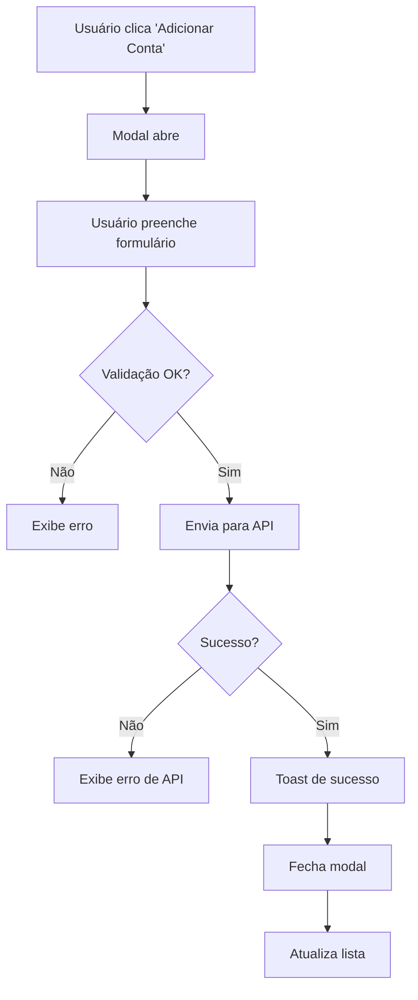
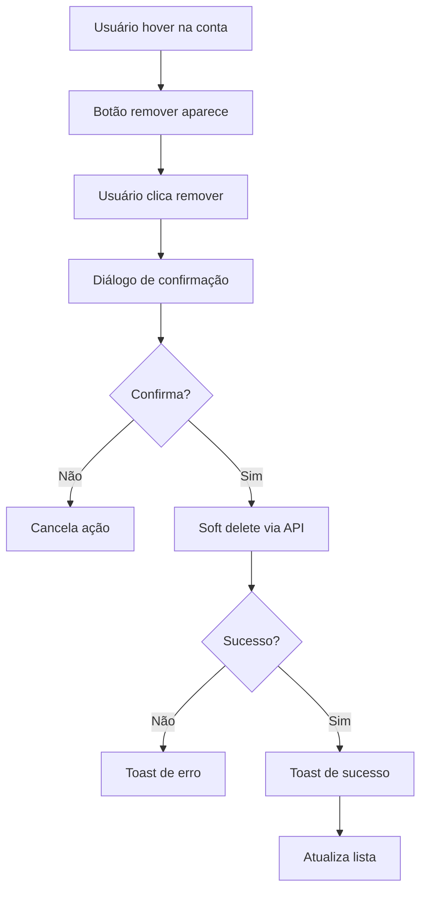

# Gerenciamento de Contas Publicitárias - Meta Ads

## 📋 Visão Geral

O sistema agora permite adicionar e remover contas publicitárias do Meta Ads manualmente, além da sincronização automática via OAuth.

---

## ✨ Funcionalidades

### 1. **Adicionar Conta Publicitária**

Permite adicionar manualmente uma conta do Meta Ads ao sistema.

#### Como Usar:
1. Acesse `/meta-ads-config`
2. Certifique-se de estar conectado ao Meta Business
3. Clique em "Adicionar Conta" no componente "Contas Publicitárias"
4. Preencha o formulário:
   - **ID da Conta**: Número da conta (com ou sem prefixo `act_`)
   - **Nome da Conta**: Nome descritivo para identificação
   - **Provedor**: Meta Ads (padrão)
5. Clique em "Adicionar Conta"

#### Validações:
- ID da conta é obrigatório
- Nome da conta é obrigatório
- Remove automaticamente o prefixo `act_` se fornecido
- Verifica duplicatas (não permite adicionar a mesma conta duas vezes)

#### Exemplo de Uso:
```typescript
const handleAddAccount = async () => {
  await addAdAccount({
    external_id: "123456789012345",
    business_name: "Minha Empresa - Anúncios",
    provider: "meta"
  });
};
```

---

### 2. **Remover Conta Publicitária**

Permite remover (soft delete) uma conta publicitária do sistema.

#### Como Usar:
1. Acesse `/meta-ads-config`
2. Localize a conta na lista de "Contas Publicitárias"
3. Passe o mouse sobre a conta (o botão de remover aparecerá)
4. Clique no ícone de lixeira
5. Confirme a remoção no diálogo

#### Comportamento:
- **Soft Delete**: A conta é marcada como inativa (`is_active = false`)
- **Dados Preservados**: Histórico de campanhas e métricas são mantidos
- **Sem Sincronização**: Novas sincronizações não ocorrerão para esta conta

#### Exemplo de Uso:
```typescript
const handleRemoveAccount = async (accountId: string) => {
  await removeAdAccount(accountId);
};
```

---

### 3. **Buscar e Filtrar Contas**

Sistema completo de busca e filtragem para facilitar o gerenciamento.

#### Recursos:
- **Busca por texto**: Nome, ID ou provedor
- **Filtro por status**: Todas, Ativas, Inativas
- **Limpeza de filtros**: Botão para resetar busca e filtros
- **Indicador de resultados**: Mostra quantas contas correspondem aos filtros

---

### 4. **Estatísticas em Tempo Real**

Cards resumidos com informações sobre as contas:
- **Total**: Quantidade total de contas conectadas
- **Ativas**: Contas em uso ativo
- **Inativas**: Contas removidas (soft delete)

---

## 🔧 Implementação Técnica

### Hook `useMetaAuth`

Funções adicionadas ao hook:

```typescript
interface UseMetaAuthReturn {
  // ... existing properties
  addAdAccount: (data: {
    external_id: string;
    business_name: string;
    provider?: string;
  }) => Promise<void>;
  removeAdAccount: (accountId: string) => Promise<void>;
  deleteAdAccount: (accountId: string) => Promise<void>; // Hard delete
  refreshData: () => Promise<void>;
}
```

#### `addAdAccount()`
- Insere nova conta na tabela `ad_accounts`
- Define `connected_by` como o usuário atual
- Define `is_active` como `true` por padrão
- Valida duplicatas (unique constraint em `external_id`)
- Atualiza lista automaticamente após inserção

#### `removeAdAccount()`
- Realiza soft delete (define `is_active = false`)
- Mantém dados históricos
- Verifica permissões (somente o usuário que adicionou pode remover)
- Atualiza lista automaticamente após remoção

#### `deleteAdAccount()`
- Realiza hard delete (remove permanentemente)
- **Uso não recomendado**: Pode quebrar integridade referencial
- Disponível apenas para casos especiais

---

## 🗄️ Estrutura do Banco de Dados

### Tabela `ad_accounts`

```sql
CREATE TABLE ad_accounts (
  id UUID PRIMARY KEY DEFAULT uuid_generate_v4(),
  provider TEXT NOT NULL DEFAULT 'meta',
  external_id TEXT NOT NULL UNIQUE,
  business_name TEXT,
  connected_by UUID REFERENCES profiles(id) ON DELETE SET NULL,
  is_active BOOLEAN DEFAULT TRUE,
  created_at TIMESTAMPTZ DEFAULT NOW(),
  updated_at TIMESTAMPTZ DEFAULT NOW(),

  -- Legacy columns (mantidos para compatibilidade)
  user_id UUID,
  ad_account_id TEXT,
  name TEXT,
  platform TEXT
);
```

### Índices

```sql
CREATE UNIQUE INDEX ux_ad_accounts_external_id ON ad_accounts(external_id);
CREATE INDEX idx_ad_accounts_connected_by ON ad_accounts(connected_by);
CREATE INDEX idx_ad_accounts_is_active ON ad_accounts(is_active);
```

### Políticas RLS

```sql
-- Usuários podem visualizar suas próprias contas
CREATE POLICY "Users can view ad accounts they connected"
ON ad_accounts FOR SELECT
USING (connected_by = auth.uid());

-- Usuários podem inserir contas
CREATE POLICY "Users can insert ad accounts they connected"
ON ad_accounts FOR INSERT
WITH CHECK (connected_by = auth.uid());

-- Usuários podem atualizar suas próprias contas
CREATE POLICY "Users can update ad accounts they connected"
ON ad_accounts FOR UPDATE
USING (connected_by = auth.uid())
WITH CHECK (connected_by = auth.uid());
```

---

## 🎨 Componentes UI

### `AddAdAccountModal`

Modal para adicionar nova conta publicitária.

**Props:**
```typescript
interface AddAdAccountModalProps {
  open: boolean;
  onOpenChange: (open: boolean) => void;
  onAdd: (data: {
    external_id: string;
    business_name: string;
    provider?: string;
  }) => Promise<void>;
}
```

**Características:**
- Formulário com validação em tempo real
- Mensagens de erro específicas
- Loading state durante submit
- Limpeza automática após sucesso
- Design consistente com o Design System

### `AdAccountsManager`

Componente principal para gerenciar contas.

**Props:**
```typescript
interface AdAccountsManagerProps {
  accounts: AdAccount[];
  onRefresh?: () => void;
  onAdd?: () => void;
  onRemove?: (accountId: string) => void;
  isLoading?: boolean;
}
```

**Características:**
- Lista todas as contas com informações detalhadas
- Sistema de busca e filtros
- Estatísticas resumidas
- Botões de ação (adicionar, atualizar, remover)
- Estados vazios informativos
- Confirmação antes de remover

---

## 🔒 Segurança

### Row Level Security (RLS)

Todas as operações respeitam RLS:
- Usuários só podem ver/editar suas próprias contas
- Inserções requerem autenticação
- Updates verificam ownership
- Deletes verificam ownership

### Validações

1. **No Frontend**:
   - Campos obrigatórios
   - Formato de ID válido
   - Nome não vazio

2. **No Backend**:
   - Unique constraint em `external_id`
   - NOT NULL em campos obrigatórios
   - Foreign key para `connected_by`
   - CHECK constraint para `provider`

---

## 📱 Fluxo de Uso

### Adicionar Conta



### Remover Conta



---

## 🐛 Tratamento de Erros

### Erros Comuns

| Erro | Causa | Solução |
|------|-------|---------|
| Conta duplicada | `external_id` já existe | Informar usuário que conta já está conectada |
| Permissão negada | Tentando editar conta de outro usuário | Verificar ownership antes de permitir ação |
| Campos obrigatórios | Formulário incompleto | Validação frontend + mensagem clara |
| Sem autenticação | Usuário não logado | Redirecionar para login |

### Mensagens de Erro

- ✅ **Específicas**: "Esta conta publicitária já está conectada"
- ✅ **Acionáveis**: "Verifique se o ID da conta está correto"
- ✅ **Amigáveis**: Evitar jargões técnicos

---

## 🧪 Testes

### Cenários de Teste

1. **Adicionar Conta**
   - [ ] Adicionar conta válida
   - [ ] Tentar adicionar conta duplicada
   - [ ] Validação de campos obrigatórios
   - [ ] Remover prefixo `act_` automaticamente
   - [ ] Cancelar adição

2. **Remover Conta**
   - [ ] Remover conta própria
   - [ ] Tentar remover conta de outro usuário
   - [ ] Confirmar remoção
   - [ ] Cancelar remoção
   - [ ] Verificar soft delete

3. **Busca e Filtros**
   - [ ] Buscar por nome
   - [ ] Buscar por ID
   - [ ] Filtrar por status (ativas/inativas)
   - [ ] Limpar filtros
   - [ ] Combinar busca + filtro

4. **Atualização**
   - [ ] Refresh manual
   - [ ] Auto-refresh após adição
   - [ ] Auto-refresh após remoção

---

## 📚 Referências

- [Migration 005_unify_ad_accounts.sql](../supabase/migrations/005_unify_ad_accounts.sql)
- [useMetaAuth Hook](../src/hooks/useMetaAuth.ts)
- [AdAccountsManager Component](../src/components/meta-ads/AdAccountsManager.tsx)
- [AddAdAccountModal Component](../src/components/meta-ads/AddAdAccountModal.tsx)
- [MetaAdsConfig Page](../src/pages/MetaAdsConfig.tsx)

---

**Última atualização**: 2025-10-18
**Versão**: 1.0.0
